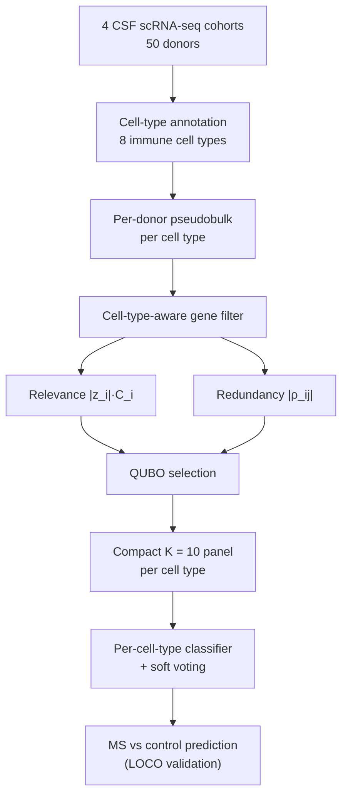

# quboFS

**quboFS** is a Python package for low-redundancy, QUBO-based feature selection from donor-level single-cell RNA-seq (scRNA-seq) pseudobulk data.

It selects compact, cell-type-specific gene panels by jointly optimising case-control relevance, cross-cohort consistency, within-panel redundancy and a fixed panel size, formulated as a Quadratic Unconstrained Binary Optimization (QUBO) problem and solved by classical simulated annealing. The method is classifier-independent: feature selection is decoupled from the downstream classifier.

The framework was developed and benchmarked for multiple sclerosis (MS) versus control classification using four publicly available cerebrospinal fluid (CSF) scRNA-seq cohorts. Three cohorts with MS and control donors (Pappalardo, Heming, Ramesh) were used as leave-one-cohort-out (LOCO) held-out cohorts, while the Touil control-only cohort was retained in training.

## Pipeline at a glance



Feature selection (relevance, redundancy and a fixed panel size) is classifier-independent and is solved by classical simulated annealing; no quantum hardware was used. The classifier is held fixed across all methods, so performance differences reflect the feature selector rather than the model.

> **Scope of the installable package.** The `qubofs` package (the `Pipeline` class) performs the **feature-selection** steps only (cell-type filtering → relevance/redundancy → QUBO panel). The per-cell-type classifier, soft voting and leave-one-cohort-out benchmark shown at the bottom of the diagram live in `scripts/`, not in `Pipeline`.

## Installation

```bash
git clone https://github.com/christina-18/qubofs.git
cd qubofs
pip install -e .
```

Requires Python ≥ 3.10. The installable package depends only on **numpy and
pandas** — the QUBO is solved by a classical simulated-annealing routine written
in pure NumPy (`qubofs.qubo`), so no QUBO-solver library is needed. These two
dependencies are declared in `pyproject.toml` and installed automatically by
`pip install -e .`. Optional extras are available for the figure scripts
(`pip install "qubofs[figures]"`), the test suite (`qubofs[test]`, adds
scikit-learn for metric cross-checks) and alternative QUBO back-ends
(`qubofs[solvers]`, adds dwave-samplers).

To reproduce the manuscript figures and the full analysis environment (which
additionally needs matplotlib and tqdm), install the pinned reproduction
requirements:

```bash
pip install -r requirements.txt
```

For development (tests, linting, type-checking, docs and the manuscript build),
install the optional dev extras:

```bash
pip install -e ".[dev]"
```

## Quick start

A minimal, Seurat-free demonstration on small synthetic pseudobulk matrices:

```bash
python examples/quickstart.py
```

This runs the full quboFS selection on toy data (`examples/toy_data/`) and prints the selected per-cell-type panels — no real patient data or R required.

## Reproducing the manuscript figures and tables

The canonical result tables for all methods are shipped in `data_release/` (matched fixed panel size K = 10, run tag `primary_bio_edger_counts`, fixed seeds), so the main tables and figures can be checked without re-running the full pipeline:

```bash
python scripts/make_canonical_figures.py     # regenerate Figures 2–4 and supplementary figures
```

The end-to-end pipeline (from the integrated Seurat object to `qubo_run/` outputs) is in `scripts/01_pipeline` → `scripts/04_aggregation` and is driven by `scripts/reproduce.sh`; see `docs/reproduction.md` for the step-by-step guide and `docs/method_details.md` for the method specification.

## Benchmark results (matched K = 10)

All six methods were compared at a matched, fixed panel size of **K = 10 genes per cell type** under leave-one-cohort-out validation (means over the three held-out cohorts, each a mean over five inner-CV folds, fixed 0.5 threshold). quboFS is a low-redundancy **panel-design** method: it produced the **lowest within-panel redundancy of any method** while retaining competitive ROC-AUC (numerically highest, but not significantly different among the disease-informed methods). The contribution is the redundancy reduction at competitive accuracy — quboFS is a panel-design method, not an accuracy maximiser.

| Method | ROC-AUC | MCC | Macro-F1 | Balanced Accuracy | σ_AUC | Mean within-panel \|ρ\| |
|---|---:|---:|---:|---:|---:|---:|
| quboFS | **0.815** | 0.255 | 0.488 | 0.623 | 0.128 | **0.247** |
| Elastic Net | 0.792 | 0.278 | **0.535** | **0.651** | 0.120 | 0.447 |
| mRMR | 0.813 | **0.283** | 0.513 | 0.636 | 0.094 | 0.279 |
| DE-top | 0.807 | 0.261 | 0.505 | 0.629 | 0.114 | 0.375 |
| LASSO | 0.776 | 0.167 | 0.451 | 0.584 | **0.084** | 0.296 |
| HVG | 0.689 | 0.264 | 0.487 | 0.619 | 0.233 | 0.465 |

quboFS had significantly lower within-panel redundancy than every baseline (paired permutation, all *p* < 0.001); ROC-AUC differences among the disease-informed methods were not significant (quboFS highest numerically; vs Elastic Net *p* = 0.502). These values are reproduced exactly by `data_release/metrics_cross_cohort.csv`.

In the primary benchmark **K is fixed at 10 for all methods**; γ and λ are tuned by inner five-fold cross-validation, and K is varied only in the sensitivity analysis. In that sweep quboFS is reported for **K ≤ 15** because the QUBO step follows a top-20 sure-independence screen (larger K are shown for baselines only).

## Method summary

For each cell type and training split, quboFS selects a binary vector **x** ∈ {0,1}^N over the N candidate genes (x_i = 1 means gene i is selected) by minimising:

```
H(x) = - α Σ_i  r̃_i x_i                  (relevance reward)
       + γ Σ_{i≠j} |ρ_ij| x_i x_j         (pairwise redundancy penalty)
       + λ ( (Σ_i x_i) - K )^2            (soft cardinality constraint)
```

(The redundancy term is the symmetric quadratic form `γ·xᵀRx` with `R = |ρ|`
and zero diagonal, i.e. the sum over ordered pairs `i ≠ j`; this is twice the
sum over unordered pairs `i < j`. The factor is absorbed into the
cross-validated `γ`.)

- **Relevance** `r̃_i`: cohort-consistency-weighted relevance score `|z_i|·C_i`, min-max rescaled to [0, 1]. `z_i` is the edgeR MS-versus-control test statistic; `C_i` is the cross-cohort consistency.
- **Redundancy** `ρ_ij`: Pearson correlation between genes i and j across training-donor pseudobulk; the absolute value treats positive and negative correlations as equally redundant.
- **Cardinality** `K`: target panel size; the soft penalty drives the solution toward exactly K genes.

`α = 1` and `K = 10` are fixed in the primary benchmark; `γ` and `λ` are selected by inner five-fold cross-validation within the training cohorts (held-out labels are never used). `K` is varied only in the panel-size sensitivity analysis. A two-stage screen-then-optimise design passes the top-20 sure-independence-screened genes per cell type to a classical simulated-annealing solver (pure-NumPy implementation, 30 reads × 600 sweeps; no quantum hardware). The QUBO matrix is solver-agnostic and is in principle compatible with `dwave-samplers` (simulated-annealing / Tabu) or quantum-annealing back-ends. Per-cell-type panels are combined by unweighted soft voting into donor-level predictions. Full specification in `docs/method_details.md`.

## Repository layout

```
qubofs/
├── src/qubofs/        # installable package (filter, relevance, qubo, pipeline, metrics, cli)
├── examples/          # quickstart.py + synthetic toy_data/
├── scripts/           # full analysis pipeline (01_pipeline → 04_aggregation) + figures
├── data_release/      # canonical result tables (matched K = 10); see data_release/README.md
├── figures/           # manuscript figures (PDF/PNG) + supplementary/
├── docs/              # reproduction.md, data_sources.md, method_details.md, PROVENANCE.md
├── tests/             # unit tests (pytest)
├── pyproject.toml, requirements.txt, CITATION.cff, LICENSE, CHANGELOG.md
```

## Data availability

The four input CSF cohorts are publicly available from their original repositories and are **not redistributed here**. Download them from the accessions listed in `docs/data_sources.md`. This repository ships synthetic toy data (`examples/toy_data/`) and the processed summary tables (`data_release/`) needed to reproduce the published results.

## Citation

If you use quboFS, please cite the manuscript and software (see `CITATION.cff`). The software version and test data used in the manuscript are archived on Zenodo: https://doi.org/10.5281/zenodo.20853495.

## Licence

MIT — see `LICENSE`.
